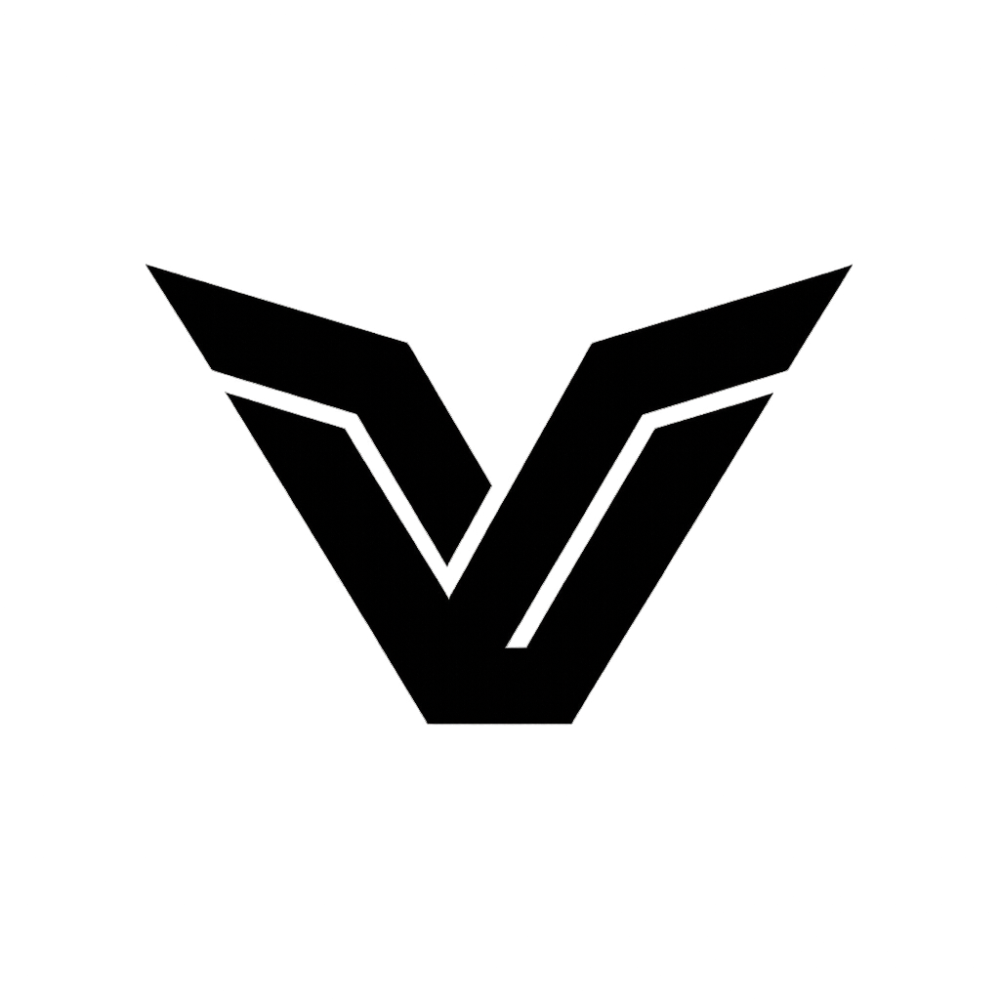

  <picture>
    <source media="(prefers-color-scheme: dark)" srcset="./assets/logo-white.png" />
    <source media="(prefers-color-scheme: light)" srcset="./assets/logo-dark.png" />
    
  </picture>
    <h1>Vyre</h1>
    
Next-generation chat and community platform built for speed, security, and modern gaming communities.

## Vision

Our mission is to help people connect with friends and communities through fast, reliable, and secure communication. We are building Vyre with a strong focus on product quality, privacy, and a seamless user experience, and we continue to invest in meaningful improvements across the platform.

## Who We Are

Vyre was founded by two friends who used Discord daily. Frustrated by product decisions that we felt did not serve users well, we set out to build a platform that reflects our values and better supports both close friend groups and broader communities.

## Contact

We are actively building Vyre. If you have questions, partnership inquiries, or feedback, please contact us:
- [contact@vyre.lol](mailto:contact@vyre.lol)
- [sam@vyre.lol](mailto:sam@vyre.lol)
- [jonas@vyre.lol](mailto:jonas@vyre.lol)